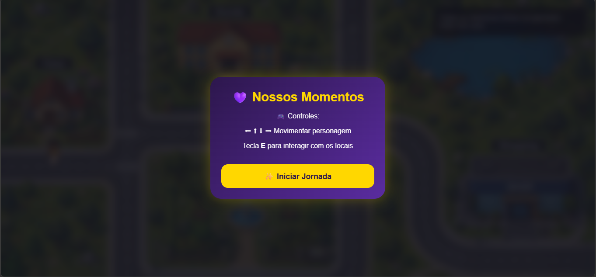
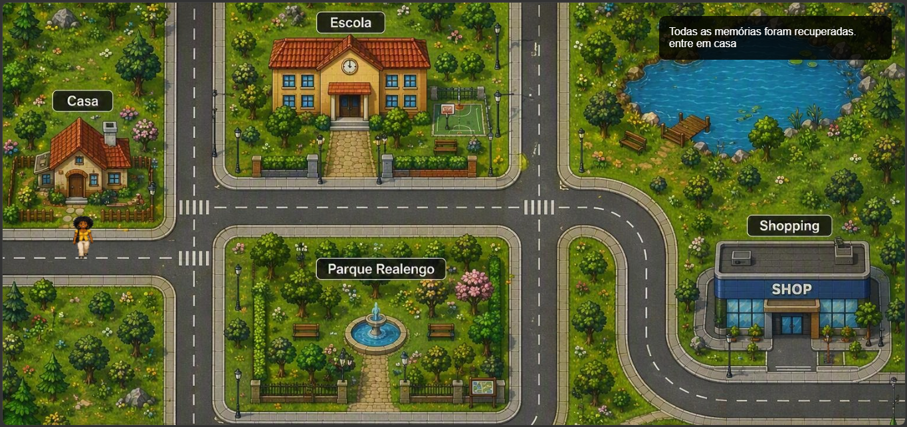

<div align="center">

# ❤️ Nossos Momentos

Um site desenvolvido para reunir e compartilhar momentos especiais através de fotos, mensagens e recordações.

🌐 Demonstração Online: https://eduardow890-droid.github.io/Nossos-Momentos/


</div>

---

# 📖 Sobre o Projeto

O **Nossos Momentos** é uma página web criada para registrar e apresentar lembranças especiais por meio de fotos, textos e elementos visuais.

O projeto foi desenvolvido com foco na prática de desenvolvimento front-end utilizando HTML, CSS e JavaScript.

---

# ✨ Funcionalidades

- 📷 Galeria de fotos
- ❤️ Mensagens personalizadas
- 📱 Layout responsivo
- 🎨 Interface moderna
- ⚡ Navegação simples e intuitiva

---

# 🚀 Tecnologias Utilizadas

- HTML5
- CSS3
- JavaScript

---

# 📸 Demonstração

## Intro do Jogo



## Página Inicial




# 📂 Estrutura do Projeto

```text
Nossos-Momentos/
│
├── index.html
├── style.css
├── script.js
├── inicio.png
├── galeria.png
├── mensagem.png
└── README.md
```

---

# ⚙️ Como Executar

Clone o repositório:

```bash
git clone https://github.com/eduardow890-droid/Nossos-Momentos.git
```

Entre na pasta:

```bash
cd Nossos-Momentos
```

Abra o arquivo:

```text
index.html
```

em seu navegador.

---

# 🎯 Objetivo

Este projeto foi desenvolvido para praticar:

- HTML Semântico
- CSS Responsivo
- JavaScript
- Organização de Projetos
- Desenvolvimento Front-end

---

# 🔮 Melhorias Futuras

- 🎵 Música de fundo opcional
- 📅 Linha do tempo de momentos
- ✨ Mais animações
- 🌙 Tema escuro
- 📱 Melhor responsividade
- 📷 Novas galerias de imagens

---

# 👨‍💻 Desenvolvedor

**Wagner Eduardo de Oliveira Henrique**

📧 Wagner.eduardo2025@outlook.com

🐙 https://github.com/eduardow890-droid

---

<div align="center">

### ⭐ Se gostou do projeto, deixe uma estrela!

Desenvolvido com ❤️ por Wagner Eduardo de Oliveira Henrique

</div>
